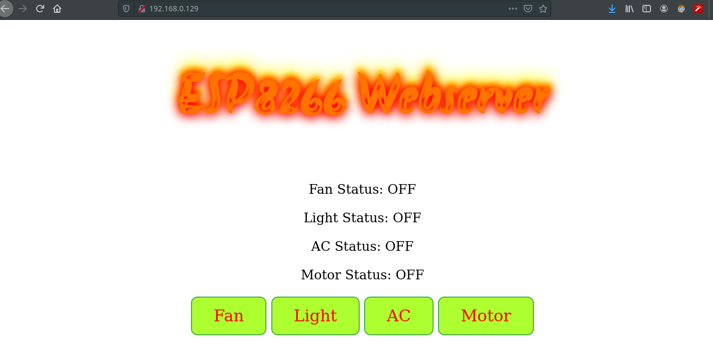

# Micro Webserver with ESP8266(Node MCU)

This project is for home automation using webbowser with standalone webserver. The html file is hosted from the MCU itself hence no need of host machine.
By going to the locally assigned Ip address to the MCU we control relays from the website. These relays then actuate respected home Electrical Appliances

### Key Points

- Uses FS system of ESP8266 to store the **html** file in MCU itself

- Uses Synchronized webserver of Node MCU

- OTA Functionality is Available hence firmware can be upgraded in future with ease. 

**Note**: More on Wiki
